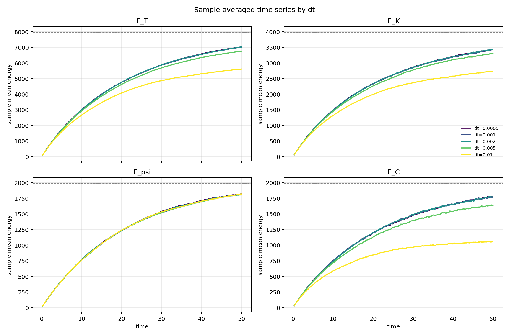
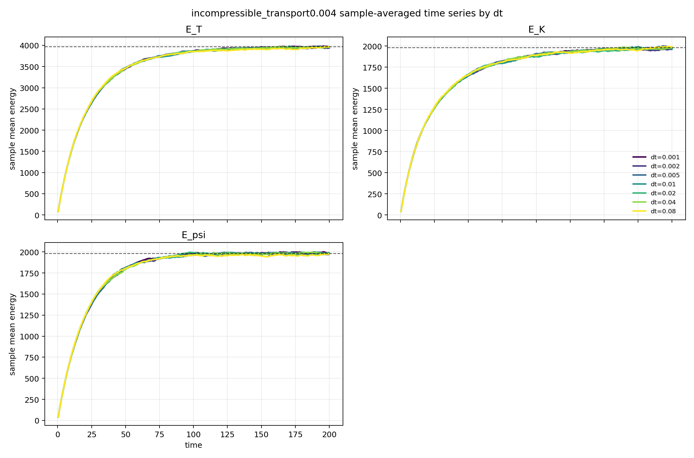
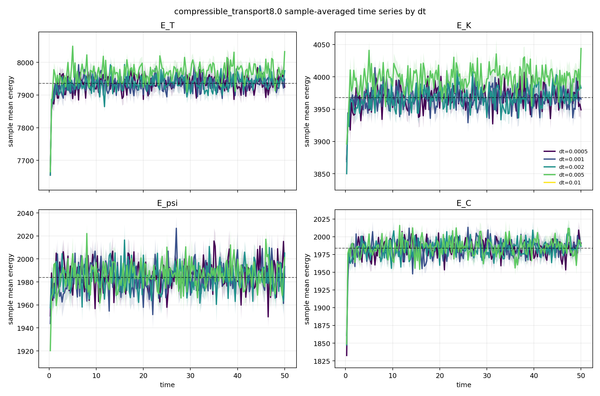
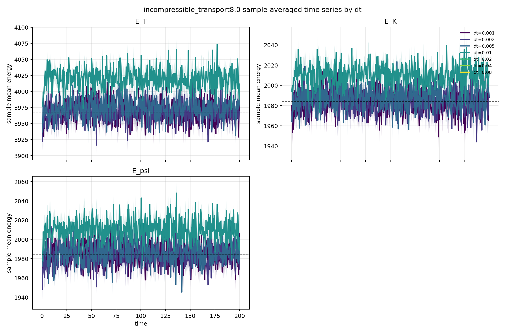

# Example 01: best_timestep_equilibrium

平衡状態への緩和 run で `dt` sweep を行い、時間刻みの選び方を確認する例である。

見る量は `measure time_series` で出力されるエネルギーである。

- compressible: `E_T`, `E_K`, `E_psi`, `E_C`
- incompressible: `E_T`, `E_K`, `E_psi`

## 結果早見表

`64 x 64` grid, `three_halves` dealiasing, `kBT = 1` で確認した目安は以下である。

| transport | compressible | incompressible |
|---:|---:|---:|
| `0.004` | `dt <= 0.002` | `dt <= 0.08` |
| `8.0` | `dt <= 0.002` | `dt <= 0.005` |

compressible では sound mode が `dt` choice を強く制限する。
incompressible では sound mode がなくなるため、主に十分小さい `dt` と同じ平衡値へ収束するかを確認する。

目安としては、最大波数に対して

```math
\max(D k_{\rm max}^2 dt,\ c_s k_{\rm max} dt) \ll 1
```

を満たすように選ぶ。
ここで

```math
k_{\rm max} \simeq \sqrt{2}\,31\,{2\pi \over 64} \simeq 4.30
```

である。

## 平衡値

incompressible の平衡値は

```text
E_T   = 3968
E_K   = 1984
E_psi = 1984
```

compressible の平衡値は

```text
E_T   = 7936
E_K   = 3968
E_psi = 1984
E_C   = 1984
```

である。

## ケース

各ケースは以下のディレクトリに置く。

```text
compressible_transport0.004/
incompressible_transport0.004/
compressible_transport8.0/
incompressible_transport8.0/
```

各ディレクトリには以下を置く。

```text
input.script
prepare_ohtaka_input.py
job_ohtaka_dt_sweep.sh
plot_results.py
results.png
```

`input.script` はテンプレートであり、`prepare_ohtaka_input.py` が `dt`, run step, 出力先, noise seed を sample ごとに差し替える。

## Ohtaka での実行

リポジトリルートから、実行したいケースの job script を投げる。

```sh
sbatch examples/01_best_timestep_equilibrium/<case>/job_ohtaka_dt_sweep.sh
```

計算結果は `/work` 側に作られる。

```text
/work/i0019/i001900/spectral-hohenberg-halperin-dynamics-2d/examples/01_best_timestep_equilibrium/<case>/runs/dt...
/work/i0019/i001900/spectral-hohenberg-halperin-dynamics-2d/examples/01_best_timestep_equilibrium/<case>/results/dt...
```

## 図の作成

`runs/` と `results/` を各ケースディレクトリへ回収した後、Docker 環境で図を作る。

```sh
docker run --rm -v "$PWD":/workspace -w /workspace spectral-hohenberg-halperin-dynamics-2d \
  python3 examples/01_best_timestep_equilibrium/<case>/plot_results.py \
  --output-root examples/01_best_timestep_equilibrium/<case>
```

出力は各ケース直下の `results.png` である。

## 結果

### Compressible, transport = 0.004



`dt <= 0.002` を選ぶのが自然である。

### Incompressible, transport = 0.004



この条件では `dt <= 0.08` まで同じ平衡値へ収束する。

### Compressible, transport = 8.0



`dt = 0.01` では energy が `NaN` になった。
有限値で得られた結果も含めると、実用上は `dt <= 0.002` を選ぶのが自然である。

### Incompressible, transport = 8.0



`dt = 0.02`, `0.04`, `0.08` では energy が `NaN` になった。
`dt = 0.01` は有限値だが小さい `dt` からのずれが見えるため、実用上は `dt <= 0.005` を選ぶのが自然である。
